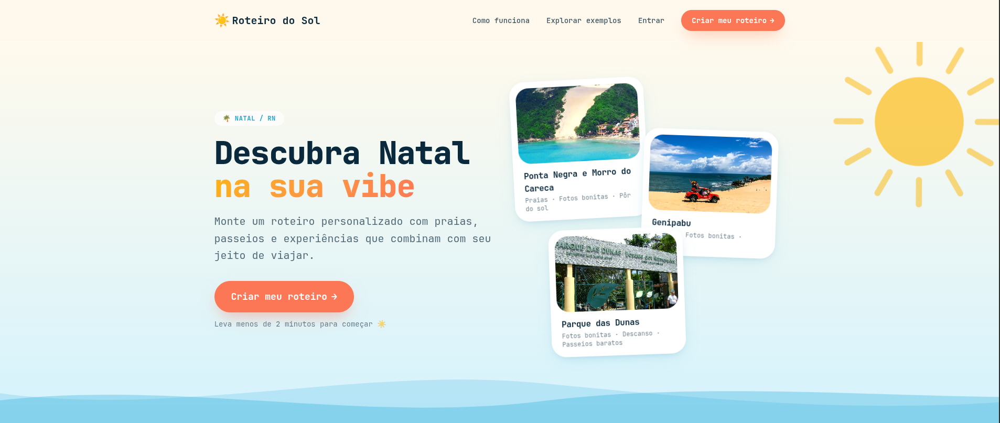
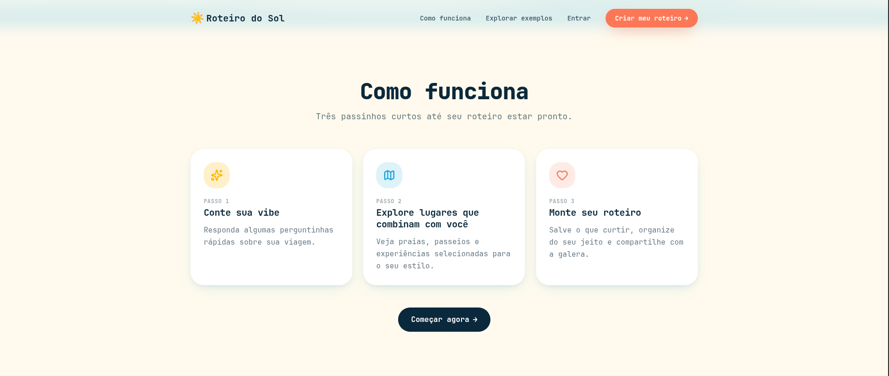

<div align="center">

# ☀️ Roteiro do Sol

**Um projeto autoral que criei para ajudar pessoas a descobrirem Natal e montarem roteiros do seu próprio jeito.**

Eu desenhei e implementei este site do início ao fim, unindo turismo, design e desenvolvimento em uma experiência que pretendo continuar aprimorando e transformando em algo cada vez mais completo e real.

<p>
  <a href="https://roteiro-do-sol-sua-viagem-swart.vercel.app/"><strong>Acessar o Roteiro do Sol</strong></a>
</p>

</div>

[](https://roteiro-do-sol-sua-viagem-swart.vercel.app/)

O site conduz a pessoa por um quiz curto sobre companhia, duração da viagem, interesses, orçamento e distância desejada. Com essas respostas, ele classifica lugares reais cadastrados no Supabase, permite montar uma seleção própria e, após autenticação com Google, gera um link público para compartilhar.

> Este não é um projeto que fiz para vender. É uma ideia minha, construída com cuidado, que quero manter, expandir e levar muito além do estado atual.

## Sumário

- [Projeto no ar](#projeto-no-ar)
- [Sobre o projeto](#sobre-o-projeto)
- [O que já construí](#o-que-já-construí)
- [Fluxo principal](#fluxo-principal)
- [Tecnologias](#tecnologias)
- [Arquitetura](#arquitetura)
- [Como as recomendações funcionam](#como-as-recomendações-funcionam)
- [Pré-requisitos](#pré-requisitos)
- [Configuração local](#configuração-local)
- [Configuração do Supabase](#configuração-do-supabase)
- [Variáveis de ambiente](#variáveis-de-ambiente)
- [Importação do catálogo](#importação-do-catálogo)
- [Scripts disponíveis](#scripts-disponíveis)
- [Rotas da aplicação](#rotas-da-aplicação)
- [Persistência e armazenamento](#persistência-e-armazenamento)
- [Segurança e privacidade](#segurança-e-privacidade)
- [SEO e compartilhamento](#seo-e-compartilhamento)
- [Estrutura de pastas](#estrutura-de-pastas)
- [Qualidade e testes](#qualidade-e-testes)
- [Estado atual](#estado-atual)
- [Onde quero chegar](#onde-quero-chegar)

## Projeto no ar

A versão atual está publicada e pode ser acessada em:

### [roteiro-do-sol-sua-viagem-swart.vercel.app](https://roteiro-do-sol-sua-viagem-swart.vercel.app/)

No site, já é possível responder ao quiz, explorar as recomendações, conhecer os lugares cadastrados, montar um roteiro, entrar com o Google, salvar a seleção e gerar um link público para compartilhamento.

Essa publicação representa o estado real do projeto em desenvolvimento. Continuarei evoluindo tanto a experiência quanto o catálogo e as funcionalidades disponíveis.

## Sobre o projeto

O **Roteiro do Sol** nasceu da vontade de criar uma forma simples e visual de conhecer Natal e seus arredores sem precisar começar a pesquisa do zero.

Além de implementar o código, também defini a identidade visual, desenhei as telas, estruturei a navegação e pensei em como transformar preferências de viagem em recomendações úteis. O projeto é um espaço onde venho reunindo desenvolvimento full-stack, UI/UX, pesquisa de conteúdo turístico, segurança e experimentação.

Em vez de inventar atrações livremente, o site trabalha com um catálogo editorial controlado. Nomes, preços, horários, localizações, imagens e demais informações exibidas vêm da base que estou construindo. A camada de recomendação apenas ordena e agrupa esses lugares de acordo com o perfil informado.

Hoje, o repositório já reúne:

- landing page responsiva;
- onboarding com cinco perguntas;
- catálogo inicial com 15 lugares;
- recomendação local e determinística;
- páginas de detalhes dos lugares;
- montagem de roteiro sem login;
- autenticação com Google pelo Supabase Auth;
- criação, edição, listagem e exclusão de roteiros salvos;
- link público com metadados para redes sociais;
- reações anônimas em roteiros compartilhados;
- área de conta e exclusão de dados;
- scripts de importação do catálogo e das imagens;
- migrações SQL de roteiros, reações e endurecimento de segurança.

## O que já construí

### Descoberta e personalização

- Quiz sobre companhia, quantidade de dias, até cinco interesses, orçamento e alcance da viagem.
- Recomendações calculadas com base em afinidade, custo, localização, duração e perfil do grupo.
- Separação entre recomendações principais e outros lugares disponíveis no catálogo.
- Explicações curtas sobre por que cada lugar combina com o perfil.
- Página de detalhes com descrição, duração, preço, localização, melhor horário e link seguro para o Google Maps.

### Montagem do roteiro

- Inclusão e remoção de lugares sem exigir conta.
- Persistência local do roteiro durante a navegação.
- Organização automática em:
  - **Cabe na sua viagem**;
  - **Se der tempo**.
- Limite de sugestões principais ajustado à quantidade de dias informada.

### Conta e compartilhamento

- Login com Google usando OAuth e fluxo PKCE do Supabase.
- Criação de um novo roteiro salvo.
- Atualização do mesmo roteiro sem alterar seu link público.
- Listagem dos roteiros do usuário.
- Edição, exclusão e cópia do link de compartilhamento.
- Compartilhamento direto pelo WhatsApp.
- Exclusão da conta e dos dados associados.

### Página pública

- URL no formato `/r/:slug`.
- Renderização no servidor para entregar conteúdo e metadados no HTML inicial.
- Open Graph, Twitter Card e URL canônica.
- Imagem de compartilhamento baseada na capa do primeiro lugar do roteiro.
- Reações anônimas com atualização otimista.
- Chamada para o visitante criar o próprio roteiro.

## Fluxo principal



Organizei a experiência principal em três momentos:

| Etapa                  | Como funciona                                                              |
| ---------------------- | -------------------------------------------------------------------------- |
| **1. Conte sua vibe**  | A pessoa responde perguntas rápidas sobre o perfil e o contexto da viagem. |
| **2. Explore lugares** | O site prioriza atrações reais que combinam com as respostas informadas.   |
| **3. Monte o roteiro** | Os lugares escolhidos são organizados, salvos e compartilhados por link.   |

Por trás dessas telas, implementei o seguinte fluxo:

1. O visitante acessa a landing page.
2. Inicia o onboarding em `/onboarding`.
3. Responde às cinco etapas do quiz.
4. As respostas são sanitizadas e gravadas em `sessionStorage`.
5. O catálogo publicado é carregado do Supabase.
6. O algoritmo local calcula o score de cada lugar.
7. O usuário escolhe lugares em `/roteiro`.
8. Os IDs selecionados são gravados em `localStorage`.
9. Em `/meu-roteiro`, os lugares são divididos conforme o tempo disponível.
10. Ao salvar ou compartilhar, o usuário entra com Google.
11. O roteiro é persistido por uma RPC transacional no Supabase.
12. O sistema gera um slug público e disponibiliza o link `/r/:slug`.

## Tecnologias

| Camada                           | Tecnologia                                |
| -------------------------------- | ----------------------------------------- |
| Runtime e gerenciador de pacotes | Bun                                       |
| Interface                        | React 19 + TypeScript                     |
| Framework full-stack             | TanStack Start                            |
| Rotas                            | TanStack Router com file-based routing    |
| Estado assíncrono                | TanStack Query                            |
| Build e desenvolvimento          | Vite 7                                    |
| Estilos                          | Tailwind CSS 4                            |
| Componentes                      | shadcn/ui + Radix UI                      |
| Formulários e validação          | React Hook Form, Zod e Hookform Resolvers |
| Ícones                           | Lucide React                              |
| Backend                          | Supabase                                  |
| Banco                            | PostgreSQL                                |
| Autenticação                     | Supabase Auth com Google OAuth            |
| Arquivos                         | Supabase Storage                          |
| Deploy server-side               | Nitro, configurado pelo preset do projeto |
| Lint e formatação                | ESLint 9 + Prettier                       |

O projeto usa o alias `@/` para apontar para `src/`.

## Arquitetura

### Frontend e SSR

O TanStack Start atende tanto a interface React quanto a renderização no servidor. As rotas ficam em `src/routes`, e `src/routeTree.gen.ts` é gerado automaticamente pelo TanStack Router.

O servidor customizado em `src/server.ts`:

- envolve a entrada SSR padrão;
- normaliza falhas graves que seriam retornadas como JSON;
- entrega uma página HTML amigável em erros 500;
- aplica cabeçalhos de segurança;
- desabilita cache em páginas privadas e respostas relacionadas à autenticação.

### Catálogo

O catálogo é lido das tabelas `places`, `place_images`, `place_vibes` e `vibes`. A interface consulta somente registros com `status = 'published'`.

Os dados editoriais de origem ficam em `data/places.json`. Esse arquivo contém descrições, informações logísticas, coordenadas, fontes de pesquisa e tags usadas para relacionar lugares às preferências do quiz.

### Roteiros

Os roteiros persistidos usam duas entidades principais:

- `itineraries`: proprietário, nome, slug público, visibilidade, respostas e datas;
- `itinerary_items`: lugares do roteiro, ordem e seção.

A criação e a atualização passam pela função SQL `save_itinerary`, que valida autenticação, quantidade de itens, duplicidades, formato das respostas e existência de lugares publicados antes de gravar tudo em uma única transação.

### Reações

Visitantes podem reagir a roteiros públicos sem login. Cada navegador recebe um UUID diferente para cada roteiro. O banco armazena somente um hash desse identificador, impedindo correlação direta com o valor local.

As contagens e escritas são feitas pelas RPCs:

- `itinerary_reaction_counts`;
- `set_itinerary_reaction`.

## Como as recomendações funcionam

A recomendação atual não usa um modelo de IA externo. Ela é local, previsível e baseada em regras.

O motor recebe:

- respostas sanitizadas do onboarding;
- lugares publicados retornados pelo Supabase;
- vibes e pesos editoriais de cada lugar.

Cada lugar ganha pontos por:

- correspondência com as vibes escolhidas;
- compatibilidade com o orçamento;
- preferência por ficar em Natal ou aceitar bate-voltas;
- duração total da viagem;
- perfil da companhia, como casal, família, amigos ou viagem solo.

Também podem existir penalizações. Por exemplo, um bate-volta perde prioridade quando o usuário escolhe ficar somente em Natal, e um lugar de custo médio perde pontos em um perfil econômico.

Depois do score, os lugares recebem um nível:

| Nível          | Significado                                |
| -------------- | ------------------------------------------ |
| `strong_match` | Forte afinidade com o perfil               |
| `good_match`   | Boa compatibilidade                        |
| `maybe`        | Pode fazer sentido, mas não é prioridade   |
| `explore_only` | Continua disponível apenas para exploração |

O limite da seleção principal depende da duração:

| Duração        | Limite principal |
| -------------- | ---------------: |
| 1 dia          |        4 lugares |
| 2 a 3 dias     |        6 lugares |
| 4 a 5 dias     |        8 lugares |
| Mais de 5 dias |       10 lugares |
| Não informado  |        7 lugares |

Existe um contrato preparado para uma futura camada de IA em `src/lib/recommendations/ai-recommendation-contract.ts`. Mesmo nessa evolução, a saída deverá ser filtrada contra o catálogo real, impedindo que o modelo invente lugares ou dados turísticos.

## Pré-requisitos

- [Bun](https://bun.sh/) instalado;
- projeto no Supabase;
- credenciais públicas do Supabase;
- provedor Google configurado no Supabase Auth para testar login;
- credencial administrativa do Supabase apenas para executar importações;
- Supabase CLI opcional, caso as migrações sejam aplicadas pela linha de comando.

O ambiente usado durante o desenvolvimento atual possui Bun `1.3.x` e Node.js `24.x`. O arquivo de lock oficial do projeto é `bun.lock`.

## Configuração local

### 1. Instale as dependências

```bash
bun install
```

O `bunfig.toml` aplica uma janela mínima de 24 horas para versões recém-publicadas, como proteção adicional contra problemas na cadeia de dependências.

### 2. Configure as variáveis públicas

Copie o arquivo de exemplo:

```bash
cp .env.example .env.local
```

Depois preencha:

```dotenv
VITE_SUPABASE_URL=https://SEU-PROJETO.supabase.co
VITE_SUPABASE_KEY=SUA_CHAVE_PUBLICAVEL_OU_ANON
```

Use somente uma chave pública no prefixo `VITE_`. O cliente rejeita chaves `service_role` ou `sb_secret_*` para evitar que credenciais administrativas sejam enviadas ao navegador.

### 3. Prepare o banco

Aplique as migrações na ordem numérica:

```text
supabase/migrations/0001_itineraries.sql
supabase/migrations/0002_itinerary_reactions.sql
supabase/migrations/0003_reaction_write_rpc.sql
supabase/migrations/0004_security_privacy_hardening.sql
supabase/migrations/0005_catalog_least_privilege.sql
```

Com a Supabase CLI configurada e o projeto vinculado:

```bash
supabase db push
```

Também é possível executar os arquivos, na ordem, pelo SQL Editor do Supabase.

> Importante: as migrações deste repositório cobrem roteiros, reações e políticas de segurança, mas pressupõem que o esquema-base do catálogo já possua as tabelas `places`, `place_images`, `place_vibes`, `vibes`, `place_sources` e os demais objetos auxiliares usados pelo projeto.

### 4. Inicie o servidor

```bash
bun run dev
```

Por padrão, a configuração atual abre a aplicação em:

```text
http://localhost:8080
```

## Configuração do Supabase

### Banco e RLS

As migrações habilitam Row Level Security e restringem o acesso de acordo com o tipo de dado:

- qualquer visitante pode ler apenas lugares publicados;
- dados editoriais internos e fontes de pesquisa não ficam disponíveis na API pública;
- usuários autenticados podem ler apenas os próprios roteiros;
- a leitura pública de um roteiro acontece por RPC e não expõe `user_id` ou respostas do onboarding;
- todas as escritas de roteiro passam por funções SQL controladas;
- reações anônimas usam RPCs e não permitem leitura direta das linhas.

### Google OAuth

No painel do Supabase:

1. Acesse **Authentication > Providers > Google**.
2. Habilite o provedor.
3. Informe o Client ID e o Client Secret criados no Google Cloud.
4. Adicione a URL de callback indicada pelo Supabase no cliente OAuth do Google.
5. Em **Authentication > URL Configuration**, cadastre as URLs permitidas da aplicação.

Para desenvolvimento, permita a origem:

```text
http://localhost:8080/**
```

O login por magic link existe na camada de autenticação, mas não está habilitado no fluxo principal enquanto o projeto não tiver uma configuração própria de SMTP.

### Storage

O importador de imagens cria ou atualiza um bucket público chamado `places`. Cada capa é armazenada em:

```text
places/{slug}/cover.webp
```

Os créditos, licença, texto alternativo e URL de origem também são registrados na tabela `place_images`.

## Variáveis de ambiente

### Aplicação

| Variável            | Obrigatória | Exposição | Uso                                                     |
| ------------------- | ----------- | --------- | ------------------------------------------------------- |
| `VITE_SUPABASE_URL` | Sim         | Pública   | URL do projeto Supabase                                 |
| `VITE_SUPABASE_KEY` | Sim         | Pública   | Chave publishable ou anon do frontend                   |
| `PUBLIC_SITE_URL`   | Produção    | Servidor  | Origem canônica usada em metadados de compartilhamento  |

As variáveis `VITE_` são incorporadas ao bundle do navegador durante a build. A segurança dos dados não depende de esconder essa chave pública, mas das policies de RLS e das RPCs configuradas no Supabase. Em produção, defina `PUBLIC_SITE_URL` (ou `SITE_URL`) com o domínio final, por exemplo `https://roteiro.example`, para que canonical/Open Graph não dependam de cabeçalhos encaminhados pelo proxy.

### Scripts administrativos

| Variável                    | Obrigatória | Exposição      | Uso                          |
| --------------------------- | ----------- | -------------- | ---------------------------- |
| `SUPABASE_URL`              | Sim         | Servidor local | URL usada pelos importadores |
| `SUPABASE_SECRET_KEY`       | Sim         | Secreta        | Chave administrativa moderna |
| `SUPABASE_SERVICE_ROLE_KEY` | Alternativa | Secreta        | Chave legada `service_role`  |

`SUPABASE_URL` pode usar `VITE_SUPABASE_URL` como fallback. Já a chave administrativa nunca deve usar prefixo `VITE_`, nunca deve ser commitada nem enviada ao navegador.

Para preparar o ambiente administrativo local:

```bash
cp .env.admin.example .env.admin.local
```

Exemplo:

```dotenv
SUPABASE_URL=https://SEU-PROJETO.supabase.co
SUPABASE_SECRET_KEY=sb_secret_...
```

Os arquivos reais `.env*` são ignorados pelo Git. Somente `.env.example` e `.env.admin.example`, que contêm placeholders, ficam versionados.

## Importação do catálogo

### Lugares

O arquivo `data/places.json` é a fonte editorial inicial. Para importar ou atualizar os lugares:

```bash
bun run import:places
```

Para usar outro arquivo:

```bash
bun run import:places -- caminho/para/lugares.json
```

O importador:

- faz `upsert` pelo slug;
- publica os registros importados;
- relaciona as vibes e seus pesos;
- insere apenas fontes ainda não cadastradas;
- preserva metadados editoriais no campo `metadata`.

Embora os 15 itens em `data/places.json` estejam marcados como `review`, o importador atual força `status = 'published'` para disponibilizá-los no frontend.

### Imagens

As imagens são descritas em `data/place-images/manifest.json`.

```bash
bun run import:images
```

Também é possível informar outro manifesto:

```bash
bun run import:images -- caminho/para/manifest.json
```

O script:

- lê uma imagem local ou baixa uma URL remota;
- restringe arquivos locais à pasta `data/place-images`;
- aceita apenas URLs HTTPS sem credenciais;
- bloqueia hosts e IPs privados para reduzir risco de SSRF;
- limita imagens a 10 MB;
- valida assinatura e tipo do arquivo;
- cria ou confirma o bucket público `places`;
- envia a imagem com `upsert`;
- atualiza a capa e os créditos no banco;
- continua processando o manifesto e mostra um resumo das falhas.

Os arquivos de imagem locais não são versionados. Somente o manifesto é mantido no Git.

## Scripts disponíveis

| Comando                 | Descrição                                    |
| ----------------------- | -------------------------------------------- |
| `bun run dev`           | Inicia o ambiente de desenvolvimento         |
| `bun run build`         | Gera a build de produção                     |
| `bun run build:dev`     | Gera o build usando o modo `development`     |
| `bun run preview`       | Serve localmente o build gerado              |
| `bun run typecheck`     | Verifica os tipos TypeScript                 |
| `bun run check`         | Executa tipos, lint e build de produção      |
| `bun run import:places` | Importa o catálogo usando `.env.admin.local` |
| `bun run import:images` | Importa as imagens usando `.env.admin.local` |
| `bun run lint`          | Executa ESLint e a integração com Prettier   |
| `bun run format`        | Formata o repositório com Prettier           |

## Rotas da aplicação

| Rota             | Acesso            | Responsabilidade                          |
| ---------------- | ----------------- | ----------------------------------------- |
| `/`              | Público           | Landing page e apresentação do projeto    |
| `/onboarding`    | Público           | Quiz de personalização                    |
| `/roteiro`       | Público           | Recomendações e catálogo                  |
| `/lugar/:slug`   | Público           | Detalhes de um lugar                      |
| `/meu-roteiro`   | Local             | Lugares escolhidos no navegador           |
| `/compartilhar`  | Login para salvar | Nome, persistência e compartilhamento     |
| `/meus-roteiros` | Autenticado       | Lista, edição e exclusão de roteiros      |
| `/minha-conta`   | Autenticado       | Sessão, dados locais e exclusão da conta  |
| `/r/:slug`       | Público           | Visualização compartilhável de um roteiro |

As rotas são definidas por arquivos em `src/routes`. Não edite `src/routeTree.gen.ts` manualmente.

## Persistência e armazenamento

### `sessionStorage`

As respostas do onboarding ficam em:

```text
roteiro-do-sol:travel-answers
```

Elas duram apenas durante a sessão da aba e são sanitizadas tanto ao salvar quanto ao carregar.

### `localStorage`

O navegador guarda:

- IDs dos lugares escolhidos;
- roteiro salvo atualmente em edição;
- reação escolhida em cada roteiro público;
- UUID anônimo e específico de cada roteiro.

Os lugares escolhidos são limitados a 50 IDs UUID válidos. O estado também escuta o evento `storage`, mantendo abas abertas em sincronia.

### Supabase

O Supabase persiste:

- usuários autenticados;
- catálogo e imagens;
- roteiros e ordem dos lugares;
- respostas sanitizadas usadas na criação do roteiro;
- reações com identificador de visitante transformado em hash.

## Segurança e privacidade

O projeto já contém várias proteções importantes:

- validação de UUIDs, slugs públicos, nomes e URLs;
- rejeição de chave administrativa no bundle público;
- fluxo OAuth PKCE;
- RLS nas tabelas do projeto;
- privilégios mínimos no catálogo;
- RPCs `SECURITY DEFINER` com `search_path` restrito;
- limite de 50 lugares por roteiro e 100 roteiros por usuário;
- slug público aleatório com 128 bits antes da codificação hexadecimal;
- leitura pública sem exposição do usuário proprietário ou das respostas;
- hash SHA-256 do identificador usado nas reações;
- sanitização de mensagens de log para remover tokens, e-mails e URLs;
- CSP, HSTS em HTTPS, proteção contra iframe e políticas de permissões;
- páginas privadas e retornos de autenticação com `Cache-Control: no-store`;
- proteção contra URLs remotas privadas no importador de imagens.

Para orientações sobre reporte responsável de vulnerabilidades, consulte `SECURITY.md` no ambiente de desenvolvimento.

## SEO e compartilhamento

A rota pública do roteiro carrega os dados no servidor antes de montar o `<head>`. Isso permite que crawlers e aplicativos de mensagem encontrem:

- título personalizado;
- descrição;
- URL canônica;
- `og:title`, `og:description`, `og:url` e `og:image`;
- Twitter Card com imagem grande;
- `robots=index, follow` apenas quando o roteiro existe e está público.

Quando a capa do lugar está em WebP, a URL Open Graph usa `images.weserv.nl` para entregar uma versão JPEG em `1200x630`, formato mais compatível com WhatsApp, Facebook, Telegram e iMessage. Se nenhuma capa segura estiver disponível, o sistema usa `public/og-default.jpg`.

## Estrutura de pastas

```text
.
├── .env.example                    # Variáveis públicas sem valores reais
├── .env.admin.example              # Variáveis administrativas sem segredos
├── data/
│   ├── places.json                  # Catálogo editorial inicial
│   └── place-images/
│       └── manifest.json            # Metadados das imagens
├── public/
│   ├── og-default.jpg               # Fallback para Open Graph
│   ├── readme-como-funciona.png     # Visão das etapas do site
│   └── readme-hero.png              # Capa visual deste README
├── src/
│   ├── assets/                      # Assets importados pelo frontend
│   ├── components/
│   │   ├── account/                 # Navegação da área da conta
│   │   ├── feedback/                # Diálogos de confirmação
│   │   ├── itinerary/               # Reações do roteiro público
│   │   ├── landing/                 # Componentes da landing page
│   │   ├── onboarding/              # Perguntas e componentes do quiz
│   │   ├── places/                  # Imagens e ações dos lugares
│   │   └── ui/                      # Componentes shadcn/ui
│   ├── hooks/                       # Hooks reutilizáveis
│   ├── lib/
│   │   ├── auth/                    # Sessão e autenticação
│   │   ├── places/                  # Formatação e previews
│   │   ├── recommendations/         # Score, agrupamento e contrato de IA
│   │   ├── roteiro/                 # Estado local do roteiro
│   │   ├── security/                # Validações
│   │   ├── seo/                     # Metadados do roteiro público
│   │   └── supabase/                # Acesso ao catálogo, roteiros e reações
│   ├── routes/                      # Rotas file-based
│   ├── scripts/                     # Importadores administrativos
│   ├── router.tsx                   # Instância do router e Query Client
│   ├── server.ts                    # Entrada SSR e headers de segurança
│   ├── start.ts                     # Middleware global
│   └── styles.css                   # Tema e estilos globais
├── supabase/
│   └── migrations/                  # Migrações SQL
├── vercel.json                      # Build e instalação na Vercel
├── vite.config.ts
├── tsconfig.json
└── package.json
```

## Qualidade e testes

Antes de enviar mudanças, execute:

```bash
bun run check
```

O projeto ainda não possui uma suíte automatizada de testes. As áreas prioritárias para testes unitários são:

- sanitização das respostas;
- cálculo de score;
- divisão e agrupamento das recomendações;
- validação de URLs, UUIDs e slugs;
- seleção da imagem e construção dos metadados de compartilhamento.

Os fluxos de autenticação, persistência e RLS também pedem testes de integração contra um projeto Supabase de desenvolvimento.

## Estado atual

O projeto já possui um fluxo funcional de ponta a ponta, mas continua em desenvolvimento. Neste momento:

- o esquema-base completo do catálogo ainda não está definido nas migrações deste repositório;
- a recomendação é baseada em regras, enquanto a integração com IA existe apenas como contrato e mock;
- o login principal está disponível somente pelo Google;
- o magic link está implementado na biblioteca, mas ainda não aparece como opção funcional;
- o catálogo inicial possui 15 lugares e precisa de revisão editorial contínua;
- preços, horários e condições turísticas precisam ser verificados periodicamente;
- ainda não construí um painel administrativo para editar o catálogo;
- ainda não adicionei testes automatizados;
- o repositório ainda não possui um arquivo de licença.

## Onde quero chegar

Quero continuar desenvolvendo o Roteiro do Sol como um projeto vivo, aumentando a qualidade das informações, a quantidade de lugares e a utilidade real para quem visita Natal e o Rio Grande do Norte.

Alguns caminhos que pretendo explorar:

- tornar todo o esquema do catálogo reproduzível por migrações;
- criar testes unitários e de integração;
- adicionar CI para lint, tipos, build e testes;
- construir um painel editorial para gerenciar lugares, fontes e imagens;
- registrar datas de revisão e alertas para informações desatualizadas;
- ampliar o catálogo para mais cidades e regiões do Rio Grande do Norte;
- reativar o login por e-mail com SMTP próprio;
- experimentar recomendações por IA executadas somente no servidor;
- adicionar observabilidade sem coletar dados pessoais desnecessários;
- definir a licença do projeto.

Mais do que concluir uma lista de funcionalidades, minha intenção é continuar evoluindo a ideia, aprender com o uso real e fazer com que o site se torne uma referência útil para descobrir o Rio Grande do Norte.
